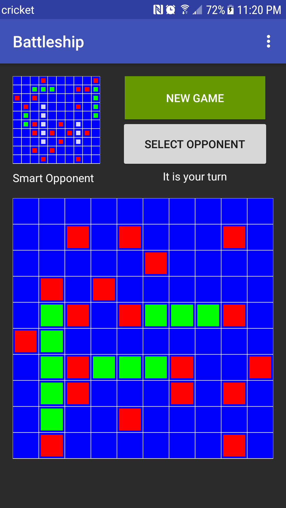

# Battleship
Mobile application for Battleship game created using Android Studio

## How-to-play
The objective of the game is to sink all of opponent's ships.  

You place your own ships at the start of the game, and the opposing player will try to sink them.  
(Do not reveal location of your ships to the other player)

Winner is the player who sinks all of the opposing player's ships.

Unlike tradiational battleship, hitting a ship gives you the ability to keep your turn.

## Game Preview

 

## Features
* Multiplayer
* Drag and drop
* AI
* Sound effects

## Authors
Gerardo Cervantes

Eric Torres
